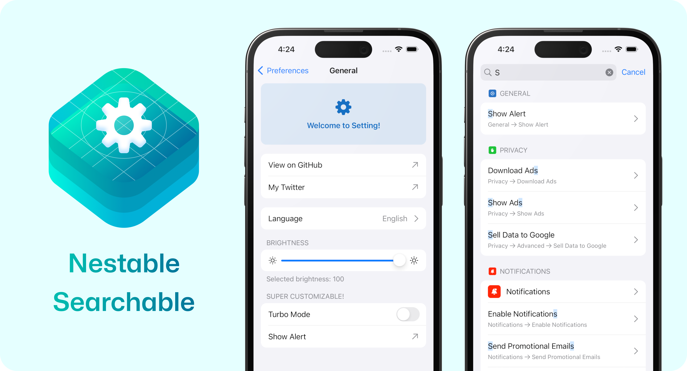
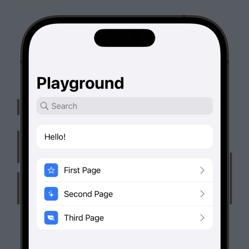
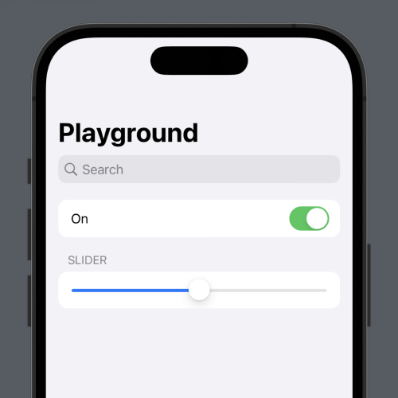
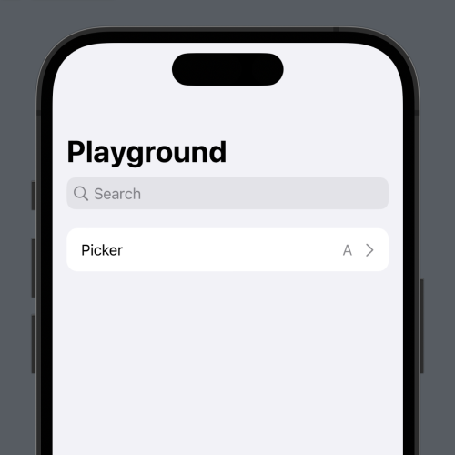
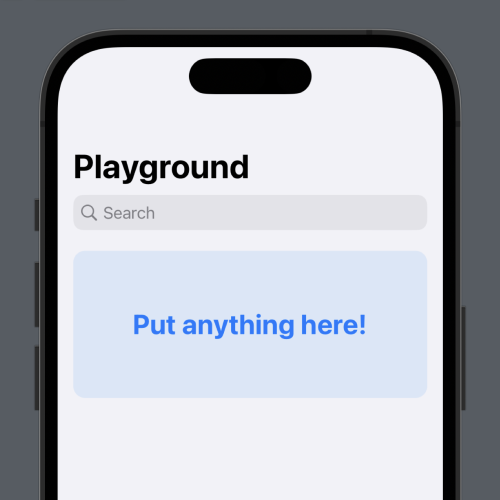

**Compose beautiful preference panels.**

- Simple but powerful syntax.
- Create nested pages and groups.
- Fully searchable.
- Native integration with SwiftUI and AppStorage.
- Comes with pre-made components: Toggle, Button, Slider, etc...
- Style components with native SwiftUI modifiers.
- Show and hide components dynamically.
- Add your own custom SwiftUI views.
- Works on iOS and macOS.




### Installation

Setting is available via the [Swift Package Manager](https://developer.apple.com/documentation/swift_packages/adding_package_dependencies_to_your_app). Requires iOS 15+ or macOS Monterey and up.

```
https://github.com/aheze/Setting
```

### Examples

View more examples in the [example app](https://github.com/aheze/Setting/tree/main/Example/SettingExample).

<table>
<tr>
<td>

```swift
import Setting
import SwiftUI

struct PlaygroundView: View {
    var body: some View {
        SettingStack {
            SettingPage(title: "Playground") {
                SettingGroup {
                    SettingText(title: "Hello!")
                }
            }
        }
    }
}
```
</td>
<td>


</td>
</tr>
</table>


<table>
<tr>
<td>

```swift
SettingStack {
    SettingPage(title: "Playground") {
        SettingGroup {
            SettingText(title: "Hello!")
        }

        SettingGroup {
            SettingPage(title: "First Page") {}
                .previewIcon("star")

            SettingPage(title: "Second Page") {}
                .previewIcon("sparkles")

            SettingPage(title: "Third Page") {}
                .previewIcon("leaf.fill")
        }
    }
}
```
</td>
<td>



</td>
</tr>
</table>


<table>
<tr>
<td>

```swift
struct PlaygroundView: View {
    @AppStorage("isOn") var isOn = true
    @AppStorage("value") var value = Double(5)

    var body: some View {
        SettingStack {
            SettingPage(title: "Playground") {
                SettingGroup {
                    SettingToggle(title: "On", isOn: $isOn)
                }

                SettingGroup(header: "Slider") {
                    SettingSlider(
                        value: $value,
                        range: 0 ... 10
                    )
                }
            }
        }
    }
}
```
</td>
<td>



</td>
</tr>
</table>

<table>
<tr>
<td>

```swift
struct PlaygroundView: View {
    @AppStorage("index") var index = 0

    var body: some View {
        SettingStack {
            SettingPage(title: "Playground") {
                SettingGroup {
                    SettingPicker(
                        title: "Picker",
                        choices: ["A", "B", "C", "D"],
                        selectedIndex: $index
                    )
                }
            }
        }
    }
}
```
</td>
<td>



</td>
</tr>
</table>


<table>
<tr>
<td>

```swift
SettingStack {
    SettingPage(title: "Playground") {
        SettingCustomView {
            Color.blue
                .opacity(0.1)
                .cornerRadius(12)
                .overlay {
                    Text("Put anything here!")
                        .foregroundColor(.blue)
                        .font(.title.bold())
                }
                .frame(height: 150)
                .padding(.horizontal, 16)
        }
    }
}
```
</td>
<td>



</td>
</tr>
</table>

### Community

Author | Contributing | Need Help?
--- | --- | ---
Setting is made by [aheze](https://github.com/aheze). | All contributions are welcome. Just [fork](https://github.com/aheze/Setting/fork) the repo, then make a pull request. | Open an [issue](https://github.com/aheze/Setting/issues) or join the [Discord server](https://discord.com/invite/Pmq8fYcus2). You can also ping me on [Twitter](https://twitter.com/aheze0).

### License

```
MIT License

Copyright (c) 2023 A. Zheng

Permission is hereby granted, free of charge, to any person obtaining a copy
of this software and associated documentation files (the "Software"), to deal
in the Software without restriction, including without limitation the rights
to use, copy, modify, merge, publish, distribute, sublicense, and/or sell
copies of the Software, and to permit persons to whom the Software is
furnished to do so, subject to the following conditions:

The above copyright notice and this permission notice shall be included in all
copies or substantial portions of the Software.

THE SOFTWARE IS PROVIDED "AS IS", WITHOUT WARRANTY OF ANY KIND, EXPRESS OR
IMPLIED, INCLUDING BUT NOT LIMITED TO THE WARRANTIES OF MERCHANTABILITY,
FITNESS FOR A PARTICULAR PURPOSE AND NONINFRINGEMENT. IN NO EVENT SHALL THE
AUTHORS OR COPYRIGHT HOLDERS BE LIABLE FOR ANY CLAIM, DAMAGES OR OTHER
LIABILITY, WHETHER IN AN ACTION OF CONTRACT, TORT OR OTHERWISE, ARISING FROM,
OUT OF OR IN CONNECTION WITH THE SOFTWARE OR THE USE OR OTHER DEALINGS IN THE
SOFTWARE.
```